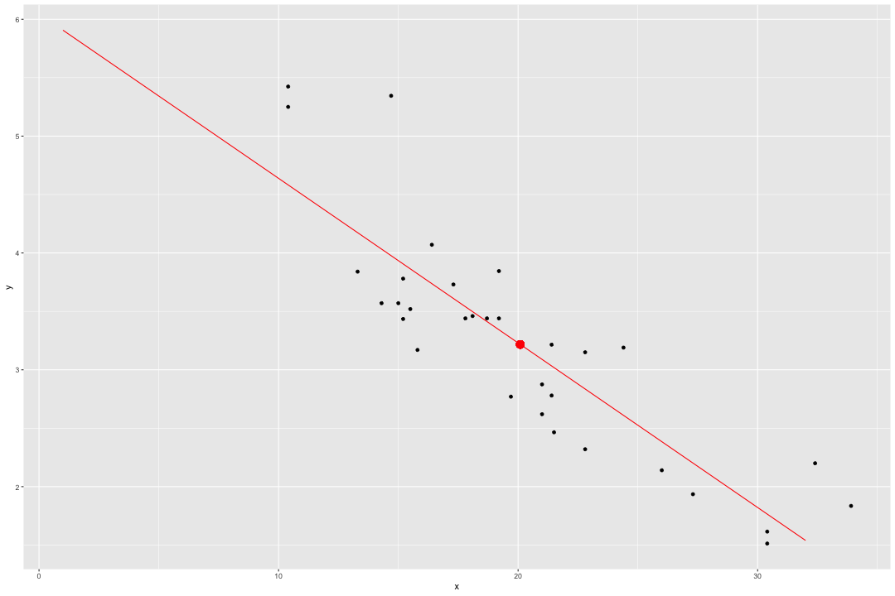

Data Analysis Application
========================================================
author: Le, Duc Anh
date: September 2018
autosize: true
DDP Week 4 Peer-graded Project

Motivation
========================================================

This web-application aims at providing a convenient tool for quick analysis on two-variable data sets.The application takes in data in form .csv file and return the following: 
- A scatter plot with regression line included
- Predicted value of dependent variable
- Summary of the regression model

The following input is required from users: 

- A .csv file contain a two-variable dataset with header
- The file format information
- Regression method required

Data Format
========================================================
The data input should be in the form of .csv file. The headers must specified "x" and "y" indicating the predictor and the independent variable respectively. A sample of desire data format is shown below:

```
     x     y
1 21.0 2.620
2 21.0 2.875
3 22.8 2.320
4 21.4 3.215
5 18.7 3.440
6 18.1 3.460
```

Sample Plot
========================================================



Deliverables
========================================================
The deliverables of this project include
- [The Data Analysis Application](https://adrianle.shinyapps.io/DataAnalysis/) hosted on shinyapps.io server
- [The Pitch Presentation](http://rpubs.com/ducanhle1992/DDPWeek4Project) hosted on rpubs
- [The Github Repository](https://github.com/Adrianle1992/DataProductWk4Project.git) containing the source codes for ui.R, server.R and this presentaion
